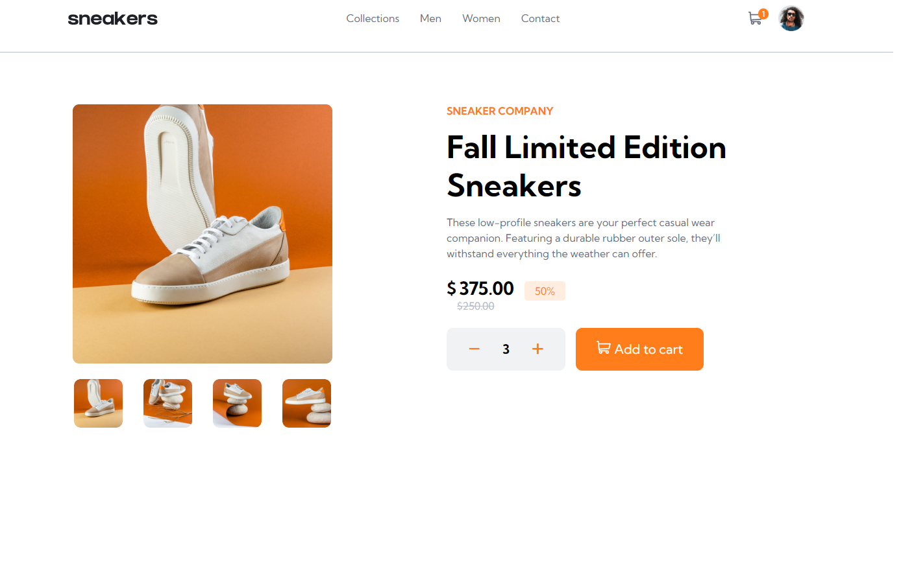

# FrontEnd Mentor Challange

This is a solution to the [E-commerce product page challenge on Frontend Mentor](https://www.frontendmentor.io/challenges/ecommerce-product-page-UPsZ9MJp6).

### Screenshot

### Links

- [Live Site URL](https://e-commerce-page-frontend.netlify.app/)

### Built with

- Semantic HTML5 markup
- CSS3
- Flexbox
- CSS Grid
- SCSS
- JS

### Things implemented

- Slideshow
- Responsive design
- Mobile Menu
- Modal

### Things user able to do

- Add product to cart
- Clear products from cart
- Use the slideshow for product images
